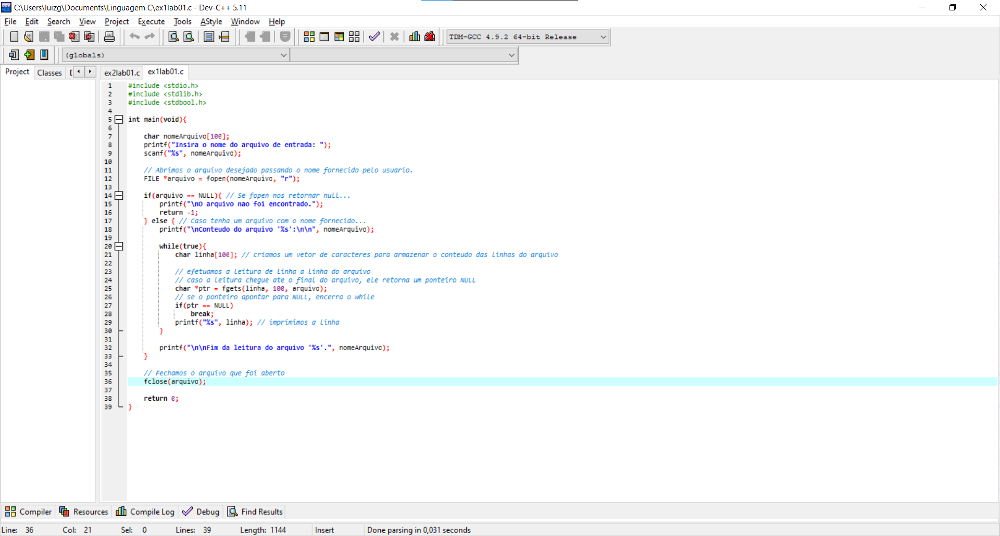
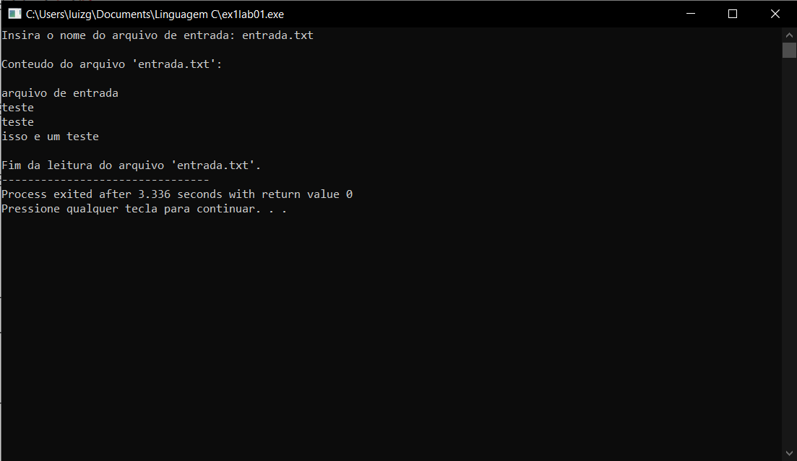
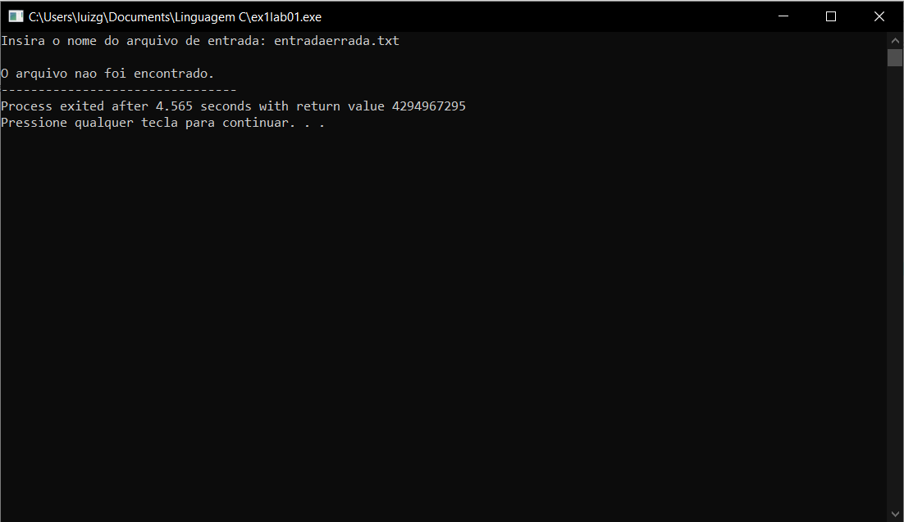
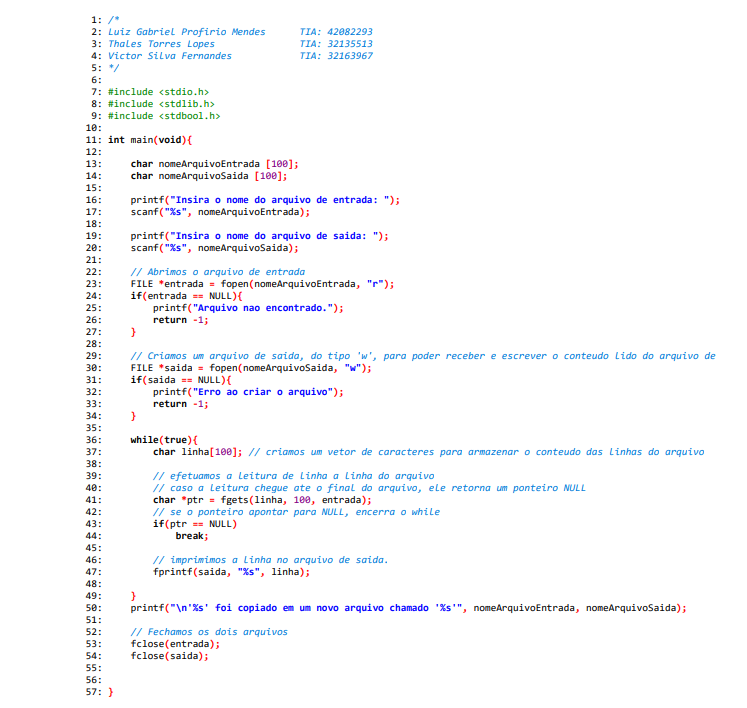
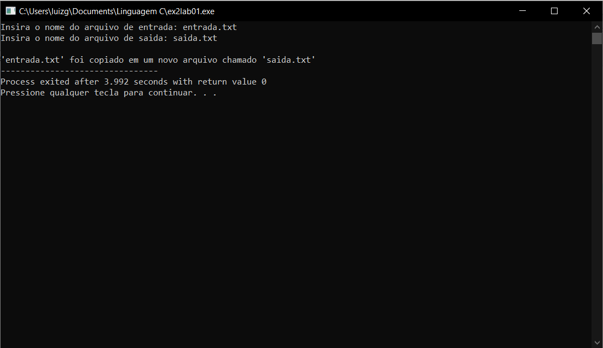
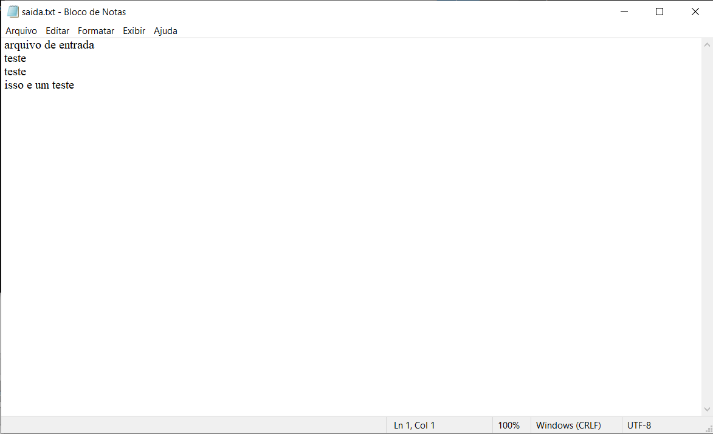
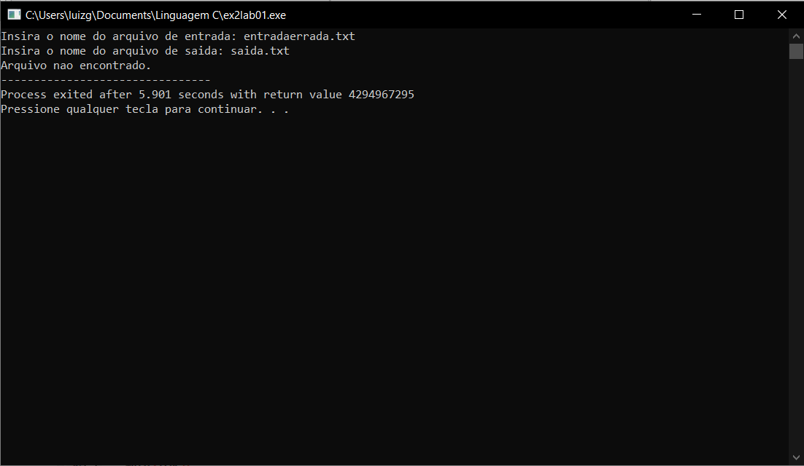
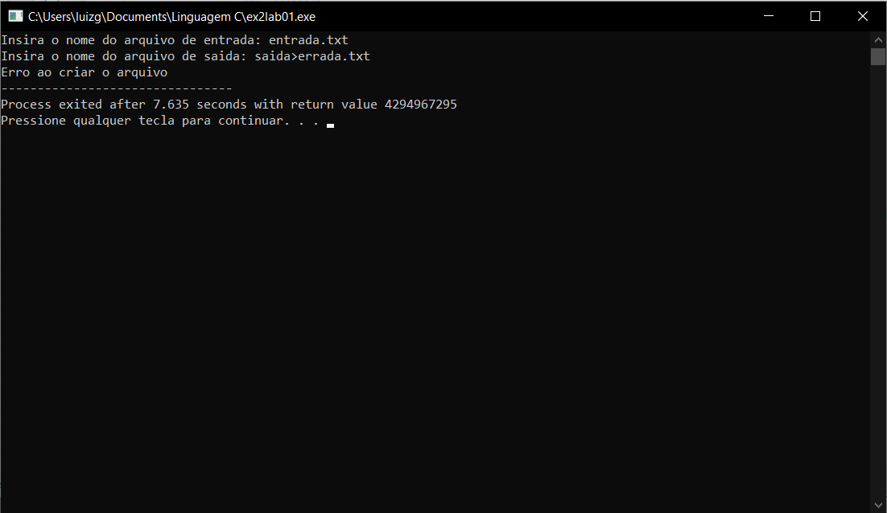

<h1> Sistemas Operacionais | Laboratório 02 </h1>

<h2>Integrantes do Grupo</h2>
<ul>
  <li>Thales Torres Lopes | TIA: 32135513</li>
 
  <li>Luiz Gabriel Profirio Mendes | TIA: 42082293</li>
 
  <li>Victor Silva Fernandes | TIA: 32163967</li>
</ul>

<h2>IDE e Compilação</h2>

<b>Ambos os exercícios foram desenvolvidos e executados no mesmo ambiente.</b>

IDE: Dev-C++

Compilador: TDM-GCC 4.9.2 64-bit Release

<h2>Exercício 01</h2>

<h3>Testes de Execução</h3>

<h4>Código</h4>

<h4>Conteúdo do Arquivo</h4>

<h4>Teste de Execução 01 [SUCESSO]</h4>

<h4>Teste de Execução 02 [ERRO]</h4>

<h3>Perguntas e Respostas</h3>

1) Identifique no seu programa as linhas de comando onde ocorrem chamadas de sistemas ao SO.

<b>R: Linhas com chamadas de sistema ao SO foram sinalizadas nos comentários do código.</b>

2) Quantas chamadas de sistemas foram realizadas?

<b>R: [RESPOSTA AQUI].</b>

 

<h2>Exercício 02</h2>

<h3>Testes de Execução</h3>

<h4>Código</h4>

<h4>Conteúdo do Arquivo de Entrada</h4>

<h4>Teste de Execução 01 [SUCESSO]</h4>

<h4>Conteúdo do Arquivo de Saída</h4>

<h4>Teste de Execução 02 [ERRO ARQUIVO DE ENTRADA]</h4>

<h4>Teste de Execução 03 [ERRO ARQUIVO DE SAÍDA]</h4>

<h3>Perguntas e Respostas</h3>

1) Identifique no seu programa as linhas de comando onde ocorrem chamadas de sistemas ao SO.

<b>R: Linhas com chamadas de sistema ao SO foram sinalizadas nos comentários do código.</b>

2) Quantas chamadas de sistemas foram realizadas?

<b>R: [RESPOSTA AQUI].</b>

