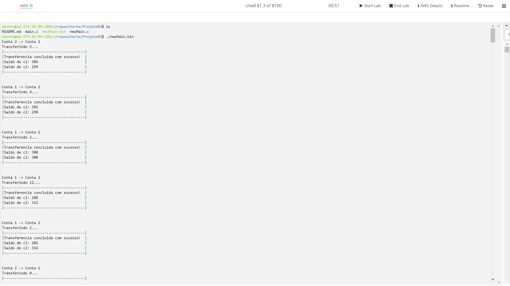
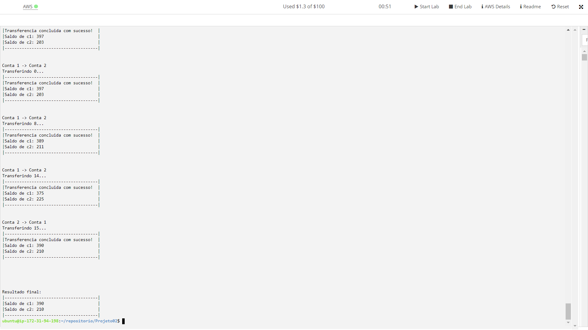

<h1>Sistemas Operacionais - Projeto 02</h1>
<h2>Integrantes do Grupo</h2>
<ul>
    <table>
        <tr>
            <th>Nome</th>
            <th>TIA</th>
        </tr>
        <tr>
            <td>Luiz Gabriel Profirio Mendes</td>
            <td>42082293</td>
        </tr>
        <tr>
            <td>Thales Torres Lopes</td>
            <td>32135513</td>
        </tr>
        <tr>
            <td>Victor Silva Fernandes</td>
            <td>32163967</td>
        </tr>
    </table>
</ul>

<h2>Objetivos</h2>
<h3>Objetivo Geral</h3>

Compreender o funcionamento do sistema operacional e sua comunicação com os dispositivos conectados.

<h3>Objetivos Específicos</h3>
<ol>
    <li>Abordar o problema da concorrência;</li>
    <li>Desenvolver um programa de computador que consuma as chamadas de sistema do SO;</li>
    <li>Conhecer e utilizar de forma ótima as chamadas de sistema do SO.</li>
</ol>

<h2>Documentação</h2>

<h3>Plataforma</h3>

O grupo optou por compilar e executar a aplicação no AWS Academy.

Dentro do AWS Academy, através do Amazon EC2, criamos uma instância que é executada na Nuvem AWS.

Informações sobre a máquina virtual:

<ul>
    <li>Imagens de aplicação e de sistema operacional</li>
    <ul>
        <li>Ubuntu Server 22.04 LTS (HVM), SSD Volume Type</li>
        <li>Descrição: Canonical, Ubuntu, 22.04 LTS, amd64 jammy image build on 2022-09-12</li>
        <li>Arquitetura: 64 bits (x86)</li>
        <li>ID da AMI: ami-08c40ec9ead489470</li>
    </ul>
    <li>Tipo de instância</li>
    <ul>
        <li>t2.micro</li>
    </ul>
    <li>Armazenamento (volumes)</li>
    <ul>
        <li>1 volume(s) - 8 GiB</li>
    </ul>
    <li>Par de chaves (login)</li>
    <ul>
        <li>vockey - tipo: rsa</li>
    </ul>
    <li>Configurações de rede</li>
    <ul>
        <li>Firewall - Criar grupo de segurança</li>
        <li>Permitir tráfego SSH de Qualquer Lugar</li>
    </ul>
</ul>

Você pode criar uma máquina virtual se baseando nas informações acima, para ter um ambiente de execução similar ao do grupo.

<h3>Acesso por SSH a instância do EC2</h3>

Aqui, nós iremos nos conectar a nossa instância criada.

<ol>
    <li>Clique no botão verde escrito "AWS", que está no canto superior esquerdo próximo ao console do Lab Learner.</li>
    <li>Selecione a instância que você quer executar.</li>
    <li>Copie o endereço IPv4 da instância. No nosso caso, é <code>3.83.151.11</code>.</li>
    <li>No console do Lab Learner, digite: <code>ssh -i ~/.ssh/labsuser.pem ubuntu@(ipv4)</code>, onde (ipv4) deve ser substituido pelo endereço IPv4 da sua instância. No nosso caso, o comando completo é: <code>ssh -i ~/.ssh/labsuser.pem ubuntu@3.83.151.11</code>.</li>
</ol>

<h3>Instalando os pacotes necessários na sua instância</h3>

Nesta parte, nós iremos realizar o download e instalar alguns pacotes necessários para que o programa seja compilado e executado adequadamente.

<ol>
    <li>Realize o download de pacotes de informação de todas as fontes configuradas.</li>
    <ul><li><code>sudo apt-get update</code></li></ul>
    <li>Realize o download e instale o gcc, que é o compilador da linguagem C.</li>
    <ul><li><code>sudo apt install gcc</code></li></ul>
</ol>

<h3>Baixando o repositório na sua instância</h3>

Para que você tenha acesso aos arquivos deste repositório, execute os comandos git abaixo.

<ol>
    <li>Crie uma paste no diretório raíz da sua instância.</li>
    <ul><li><code>mkdir repositorio</code></li></ul>
    <li>Acesse o diretório criado.</li>
    <ul><li><code>cd repositorio</code></li></ul>
    <li>Inicie um repositório git dentro do repositório.</li>
    <ul><li><code>git init</code></li></ul>
    <li>Conecte-se ao nosso repositório.</li>
    <ul><li><code>git remote add origin https://github.com/ThalesTTL/SistemasOperacionais.git</code></li></ul>
    <li>Baixe o repositório na sua máquina.</li>
    <ul><li><code>git pull origin main</code></li></ul>
    <li>Acesse o diretório Projeto02.</li>
    <ul><li><code>cd Projeto02</code></li></ul>
</ol>

<h3>Compilação</h3>

Dentro do diretório Projeto02, execute o seguinte comando para compilar o arquivo newMain.c:

<code>gcc -g -Wall -o newMain.bin newMain.c -lpthread</code>

<h3>Execução</h3>

Dentro do diretório Projeto02, execute o seguinte comando para executar o arquivo newMain.bin: 

<code>./newMain.bin</code>

<h2>Conclusão</h2>

Essa sessão busca exibir os resultados obtidos ao executar a aplicação e, por meio destes resultados, comprovar que o nosso código atende as exigências do projeto.

<!--Inserir aqui a comprovação dos resultados obtidos!-->
<h3>Prints de Execução</h3>

<h4>Sobre os prints de execução</h4>

Este programa executa 100 threads, ou seja, ocorrem 100 transações a cada execução. Em razão da quantidade enorme de transações, optamos por exibir apenas o início e o fim da saída do programa, visto que as transações se modificam apenas no valor.

<b>Obs: </b>existe uma possibilidade de que os prints de transação saiam "embaralhados" na sua execução. Isso não significa que o programa não está funcionando. Muito pelo contrário, significa que as threads estão sendo executadas simultâneamente. Embora os prints saiam embaralhados, as transações estão sendo realizadas corretamente.

<h3>Como este código atende aos requisitos do projeto?</h3>

O grupo, através da linguagem C aliada a diversas bibliotecas, entre elas 'pthread.h', conseguiu solucionar a condição de corrida apresentada.

Por meio da criação e inicialização de threads que executam as funções de transferência, pudemos comprovar através dos testes de execução, que ambas as contas podem enviar e receber dinheiro simultâneamente sem causar nenhum tipo de problema.
 

Além disso, foi criada uma consistência dentro das funções de transferência para que uma conta não efetue uma transferência caso não tenha saldo suficiente. Quando uma conta estiver sem saldo, ela irá aguardar uma quantidade de tempo para ter saldo suficiente para concluir a transação. Após o tempo determinado pelo algoritmo, caso aquela thread não consiga concluir a transação, a transação é cancelada.

Todos esses pontos foram devidamente esclarecidos no nosso código fonte definitivo, newMain.c, através de comentários no código. A leitura é altamente recomendada para compreender os detalhes dessa implementação.

